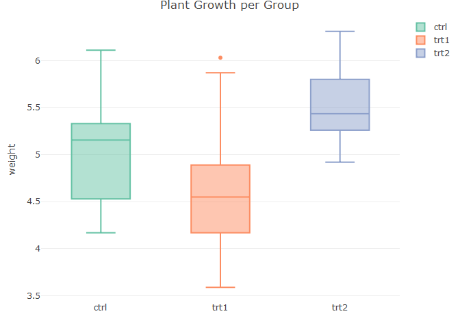

FA8 - 1B ANOVA
================
Cuerdo, Naomi Hannah A.
2024-11-07

## Assumptions

**Assumption \#1:** You have one dependent variable that is measured at
the continuous level.

**Assumption \#2:** You have one independent variable that consists of
three or more categorical, independent groups.

**Assumption \#3:** You should have independence of observations, which
means that there is no relationship between the observations in each
group of the independent variable or among the groups themselves.

**Assumption \#4:** There should be no significant outliers in the three
or more groups of your independent variable in terms of the dependent
variable.

**Assumption \#5:** Your dependent variable should be approximately
normally distributed for each group of the independent variable.

**Assumption \#6.** You have homogeneity of variances (i.e., the
variance of the dependent variable is equal in each group of your
independent variable).

## Null and Alternative Hypotheses

H₀: The mean plant weight is the same across all groups

H₁:At least one group’s average plant weight differs from the others.

## Dataset and Problem

A research wants to determine whether different treatments have an
impact on plant growth. Specifically, they want to know if there is a
statistically significant difference in the average weight of plants
between the three treatment groups. Thus, the research would like to ask
the following question: ***is there a significant difference in the mean
weight of plants across the different treatment groups, namely: ctrl,
trt1, and trt2?***

## Descriptive Statistics

``` r
summary(PlantGrowth)
```

    ##      weight       group   
    ##  Min.   :3.590   ctrl:10  
    ##  1st Qu.:4.550   trt1:10  
    ##  Median :5.155   trt2:10  
    ##  Mean   :5.073            
    ##  3rd Qu.:5.530            
    ##  Max.   :6.310

## Checking of Assumptions

``` r
str(PlantGrowth)
```

    ## 'data.frame':    30 obs. of  2 variables:
    ##  $ weight: num  4.17 5.58 5.18 6.11 4.5 4.61 5.17 4.53 5.33 5.14 ...
    ##  $ group : Factor w/ 3 levels "ctrl","trt1",..: 1 1 1 1 1 1 1 1 1 1 ...

**Assumption \#1:** You have one dependent variable that is measured at
the continuous level.

**Remark.** The weight variable is continuous, so this assumption is
met.

**Assumption \#2:** You have one independent variable that consists of
three or more categorical, independent groups.

**Remark.** The group variable in the dataset has three distinct levels
(ctrl, trt1, and trt2), which satisfies the assumptions.

**Assumption \#3:** You should have independence of observations, which
means that there is no relationship between the observations in each
group of the independent variable or among the groups themselves.

**Remark.** Since the dataset is from an experimental setup with
separate groups, we assume that observations must also be independent.

**Assumption \#4:** There should be no significant outliers in the three
or more groups of your independent variable in terms of the dependent
variable.

``` r
plot_ly(PlantGrowth, y = ~weight, color = ~group, type = "box") %>% layout(title = "Plant Growth per Group")
```

<!-- -->

**Remark.** The boxplot above shows one outlier in the **tr1** group,
represented by a point outside the whiskers of a box. This suggests that
there is a higher value compared to the majority of the data in that
group, however, while this may not severely impact the ANOVA results,
its presence should be noted.

**Assumption \#5:** Your dependent variable should be approximately
normally distributed for each group of the independent variable.

If p-values from the Shapiro-Wilk test are above 0.05 for each group,
the data are approximately normally distributed, and this assumption is
met.

``` r
by(PlantGrowth$weight, PlantGrowth$group, shapiro.test)
```

    ## PlantGrowth$group: ctrl
    ## 
    ##  Shapiro-Wilk normality test
    ## 
    ## data:  dd[x, ]
    ## W = 0.95668, p-value = 0.7475
    ## 
    ## ------------------------------------------------------------ 
    ## PlantGrowth$group: trt1
    ## 
    ##  Shapiro-Wilk normality test
    ## 
    ## data:  dd[x, ]
    ## W = 0.93041, p-value = 0.4519
    ## 
    ## ------------------------------------------------------------ 
    ## PlantGrowth$group: trt2
    ## 
    ##  Shapiro-Wilk normality test
    ## 
    ## data:  dd[x, ]
    ## W = 0.94101, p-value = 0.5643

**Remark.** Since the p-values of all groups are greater than 0.05, we
fail to reject the null hypothesis of the Shapiro-Wilk test. This
suggests that the weight variable is normally distributed within each
group, meeting the normality assumption for ANOVA.

**Assumption \#6.** You have homogeneity of variances (i.e., the
variance of the dependent variable is equal in each group of your
independent variable).

If the Levene’s test p-value is above 0.05, the variances are equal
across groups, satisfying the assumption.

``` r
leveneTest(weight ~ group, data = PlantGrowth)
```

    ## Levene's Test for Homogeneity of Variance (center = median)
    ##       Df F value Pr(>F)
    ## group  2  1.1192 0.3412
    ##       27

**Remark.** Since the p-value of 3.412 is greater than 0.05, we fail to
reject the null hypothesis of equal variances. This indicates that the
assumption of homogenity of variances is met, allowing us to proceed
with ANOVA.

## ANOVA test

If p \< 0.05, the groups are significantly different, so we proceed with
a post hoc test. If p ≥ 0,05, there is no significant difference between
the groups and there is no need for a post hoc test.

``` r
anova_model <- aov(weight ~ group, data = PlantGrowth)
summary(anova_model)
```

    ##             Df Sum Sq Mean Sq F value Pr(>F)  
    ## group        2  3.766  1.8832   4.846 0.0159 *
    ## Residuals   27 10.492  0.3886                 
    ## ---
    ## Signif. codes:  0 '***' 0.001 '**' 0.01 '*' 0.05 '.' 0.1 ' ' 1

**Remark.** Since the p value of 0.0159 \< 0.05, there is a significant
difference in weight between at least two of the treatment groups. Thus,
we proceed with the post hoc test.

## Post Hoc Test using Tukey’s Honest Significant Difference (HSD)

``` r
tukey_results <- TukeyHSD(anova_model)
tukey_results
```

    ##   Tukey multiple comparisons of means
    ##     95% family-wise confidence level
    ## 
    ## Fit: aov(formula = weight ~ group, data = PlantGrowth)
    ## 
    ## $group
    ##             diff        lwr       upr     p adj
    ## trt1-ctrl -0.371 -1.0622161 0.3202161 0.3908711
    ## trt2-ctrl  0.494 -0.1972161 1.1852161 0.1979960
    ## trt2-trt1  0.865  0.1737839 1.5562161 0.0120064

**Remark.** There is a significant difference in weight between the trt2
and trt\` groups (p=0.012), which means trt2 has a significantly higher
weight than trt1. Moreover, there are no significant differences between
ctrl and trt1 or ctrl and trt2, as both groups have a p value that is
greater than 0.05.

This suggests that the trt2 treatment had a distinct effect on plant
growth compared to trt1, but neither treatment differed significantly
from the control group in terms of weight.

## Report

A one way ANOVA test was conducted to determine if there is a
significant difference in plant weight across three groups subjected to
different treatments: a control group and two treatment groups
(treatment 1 and treatment 2). Assumptions were check before proceeding
to ANOVA. Visual inspection revealed that there is one outlier, however
it does not significantly affect the results; the Shapiro-Wilk test
indicated that the data were normally distributed for each group as the
p-value is \> 0.05. Levene’s test confirmed the homogenity of variances
(0.3412). The results of the ANOVA revealed a significant difference in
plant weight between the groups,F(2, 27) = 4.846, p = 0.0159. This
suggests that at least one treatment group differed in plant weight
compared to others.

In the post hoc analysis using Tukey’s test, no statistically
significant differences were found between treatment 1 and the control
group (mean difference = -0.37, 95% CI \[-1.06, 0.32\], p = 0.391) or
between treatment 2 and the control group (mean difference = 0.49, 95%
CI \[-0.20, 1.19\], p = 0.198), but there was a statisitcal difference
between the plant weight from treatment 1 to treatment 2 ((mean
difference = 0.87, 95% CI \[0.17, 1.56\], p = 0.012).

In conclusion, the findings suggest that treatment 2 significantly
increased plant weight compared to treatment 1, despite not having any
significant differences between the dependent and independent groups.
Thus, this suggests that treatment 2 is much more effective on plant
growth compare to treatment 1.
