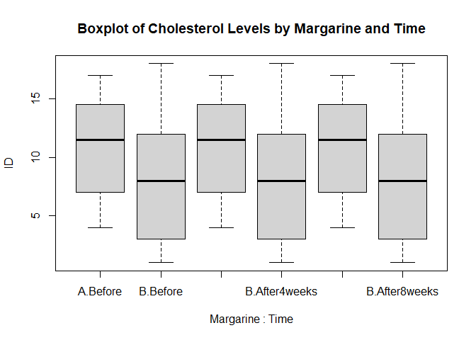

FA10 - Two-Way Mixed ANOVA - Report on the Effects of Margarine Type and
Time on Cholesterol Levels
================
Cuerdo, Naomi Hannah A., Percia, Kyte Daiter M.
2024-11-26

# Introduction

This report examines the effect of margarine brand and time on
cholesterol levels. Cholesterol levels were recorded on a continuous
scale, with higher values indicating greater cholesterol concentrations.
The margarine brand (“A” and “B”) and time of measurement (“Before”,
“After 4 Weeks”, and “After 8 Weeks”) were used as independent variables
to determine their effects on cholesterol levels. Furthermore, this
report also discusses the interaction between margarine brand and time
to understand how these factors influence changes in cholesterol over
time.

# Method

## Participants

Participants in the study consisted of 18 individuals, categorized based
on the type of margarine they consumed:

- Margarine:
  - Brand A: 9 Participants
  - Brand B: 9 Participants

On the other hand, Cholesterol levels, the dependent variable, were
measured at three different time points: **Before, After 4 weeks, and
After 8 weeks**. These are the independent variables, measured at a
continuous scale.

This dataset provides a basis for examining how margarine type and time
influence changes in cholesterol levels.

## Procedure

The data was analyzed using a Two-Way Mixed ANOVA with one
between-subjects factor (margarine brand) and one within subjects
(time). This statistical method was chosen to assess the main effects of
margarine type and time, as well as their potential interaction, on
cholesterol levels.

Below are the assumptions:

***Assumption 1.*** There is a continuous dependent variable.
(Cholesterol Level)

***Assumption 2.*** There are between-subjects factor (*Margarine*) that
is categorical with two or more categories.

***Assumption 3.*** There are one within-subjects factor (*Time*) that
is categorical with two or more categories.

***Assumption 4.*** There should be no significant outliers in any cell
of the design.

***Assumption 5.*** The dependent variable should be approximately
normally distributed for each cell of the design.

***Assumption 6.*** The variance of your dependent variable should be
equal between the groups of the between-subjects factor, referred to as
the assumption of homogeneity of variances.

***Assumption 7.*** There should be homogeneity of covariances.

***Assumption 8.*** The variance of differences between groups should be
equal, referred to as the assumption of sphericity.

# Hypotheses

**1.Main Effect of Margarine Type:** H₀:There is no significant effect
of margarine type on cholesterol levels. H₁: There is a significant
effect of margarine type on cholesterol levels.

**2.Main Effect of Margarine Type:** H₀:There is no significant effect
of time on cholesterol levels: H₁: There is a significant effect of time
on cholesterol levels.

**3.Interaction Effect (Margarine Type x Time):** H₀:There is no
significant effect between  
margarine type and time on cholesterol levels. H₁: There is a
significant effect of between margarine type and time on cholesterol
levels.

# Descriptive Analysis

``` r
descriptive_stats <- data %>%
  gather(key = "Time", value = "Cholesterol", Before, After4weeks, After8weeks) %>%
  group_by(Margarine, Time) %>%
  summarise(
    `Mean Cholesterol Level` = mean(Cholesterol, na.rm = TRUE),
    `Standard Deviation` = sd(Cholesterol, na.rm = TRUE),
    .groups = "drop"
  )
```

``` r
print(descriptive_stats)
```

    ## # A tibble: 6 × 4
    ##   Margarine Time        `Mean Cholesterol Level` `Standard Deviation`
    ##   <chr>     <chr>                          <dbl>                <dbl>
    ## 1 A         After4weeks                     5.47                1.39 
    ## 2 A         After8weeks                     5.41                1.37 
    ## 3 A         Before                          5.94                1.43 
    ## 4 B         After4weeks                     6.14                0.815
    ## 5 B         After8weeks                     6.08                0.779
    ## 6 B         Before                          6.78                0.866

``` r
str(data_long$Cholesterol)
```

    ##  num [1:54] 6.42 5.83 5.75 6.76 6.2 6.13 6.56 5.83 5.71 4.8 ...

Since it is shown that Cholesterol is numeric, *assumption 1 was
achieved.*

``` r
table(data_long$Margarine)
```

    ## 
    ##  A  B 
    ## 24 30

Since Margarine has categorical variables A and B, *assumption 2 was
achieved*

``` r
levels(data_long$Time)
```

    ## [1] "Before"      "After4weeks" "After8weeks"

Since Time has a categorical level with three levels, *Assumption 3 was
achieved*

Checking for Outliers:

``` r
boxplot(ID ~ Margarine * Time, data = data_long, 
        main = "Boxplot of Cholesterol Levels by Margarine and Time")
```

<!-- -->

From the given dataset, it seems that there are no outliers after
reshaping the data. Thus, *Assumption 4 was achieved.*

``` r
by(data_long$Cholesterol, list(data_long$Time, data_long$Margarine), shapiro.test)
```

    ## : Before
    ## : A
    ## 
    ##  Shapiro-Wilk normality test
    ## 
    ## data:  dd[x, ]
    ## W = 0.90053, p-value = 0.2922
    ## 
    ## ------------------------------------------------------------ 
    ## : After4weeks
    ## : A
    ## 
    ##  Shapiro-Wilk normality test
    ## 
    ## data:  dd[x, ]
    ## W = 0.87106, p-value = 0.1544
    ## 
    ## ------------------------------------------------------------ 
    ## : After8weeks
    ## : A
    ## 
    ##  Shapiro-Wilk normality test
    ## 
    ## data:  dd[x, ]
    ## W = 0.87638, p-value = 0.1738
    ## 
    ## ------------------------------------------------------------ 
    ## : Before
    ## : B
    ## 
    ##  Shapiro-Wilk normality test
    ## 
    ## data:  dd[x, ]
    ## W = 0.88095, p-value = 0.1338
    ## 
    ## ------------------------------------------------------------ 
    ## : After4weeks
    ## : B
    ## 
    ##  Shapiro-Wilk normality test
    ## 
    ## data:  dd[x, ]
    ## W = 0.92494, p-value = 0.4
    ## 
    ## ------------------------------------------------------------ 
    ## : After8weeks
    ## : B
    ## 
    ##  Shapiro-Wilk normality test
    ## 
    ## data:  dd[x, ]
    ## W = 0.89941, p-value = 0.2159

Since all p values are greater than 0.05, *assumption 5 was achieved.*

``` r
levene_test <- leveneTest(Cholesterol ~ Margarine * Time, data = data_long)
print("Levene's Test for Homogeneity of Variance:")
```

    ## [1] "Levene's Test for Homogeneity of Variance:"

``` r
print(levene_test)
```

    ## Levene's Test for Homogeneity of Variance (center = median)
    ##       Df F value  Pr(>F)  
    ## group  5  2.6669 0.03315 *
    ##       48                  
    ## ---
    ## Signif. codes:  0 '***' 0.001 '**' 0.01 '*' 0.05 '.' 0.1 ' ' 1

Since the p value is less than 0.05, the assumption has been violated.
We will, however, try to conduct a non parametric test to proceed with
the analysis:

``` r
friedman_test <- friedman.test(Cholesterol ~ Time | ID, data = data_long)
print(friedman_test)
```

    ## 
    ##  Friedman rank sum test
    ## 
    ## data:  Cholesterol and Time and ID
    ## Friedman chi-squared = 29.778, df = 2, p-value = 3.419e-07

``` r
kruskal_test <- kruskal.test(Cholesterol ~ Time, data = data_long)
print(kruskal_test)
```

    ## 
    ##  Kruskal-Wallis rank sum test
    ## 
    ## data:  Cholesterol by Time
    ## Kruskal-Wallis chi-squared = 2.9771, df = 2, p-value = 0.2257

Since the p value is less than 0.05, this indicates that there is a
significant difference between the time points, i.e., **Before vs. After
4 weeks, After 4 weeks vs. After 8 weeks, and Before vs After 8 weeks.**
Thus, *assumption 6 was still violated.*.

``` r
gls_model <- gls(
  Cholesterol ~ Margarine * Time, 
  data = data_long,
  weights = varIdent(form = ~ 1 | Margarine)
)
summary(gls_model)
```

    ## Generalized least squares fit by REML
    ##   Model: Cholesterol ~ Margarine * Time 
    ##   Data: data_long 
    ##        AIC      BIC    logLik
    ##   168.7293 183.6989 -76.36463
    ## 
    ## Variance function:
    ##  Structure: Different standard deviations per stratum
    ##  Formula: ~1 | Margarine 
    ##  Parameter estimates:
    ##        B        A 
    ## 1.000000 1.701692 
    ## 
    ## Coefficients:
    ##                               Value Std.Error   t-value p-value
    ## (Intercept)                 5.94500 0.4937974 12.039352  0.0000
    ## MargarineB                  0.83300 0.5578526  1.493226  0.1419
    ## TimeAfter4weeks            -0.47625 0.6983349 -0.681979  0.4985
    ## TimeAfter8weeks            -0.53625 0.6983349 -0.767898  0.4463
    ## MargarineB:TimeAfter4weeks -0.16175 0.7889227 -0.205026  0.8384
    ## MargarineB:TimeAfter8weeks -0.16675 0.7889227 -0.211364  0.8335
    ## 
    ##  Correlation: 
    ##                            (Intr) MrgrnB TmAft4 TmAft8 MB:TA4
    ## MargarineB                 -0.885                            
    ## TimeAfter4weeks            -0.707  0.626                     
    ## TimeAfter8weeks            -0.707  0.626  0.500              
    ## MargarineB:TimeAfter4weeks  0.626 -0.707 -0.885 -0.443       
    ## MargarineB:TimeAfter8weeks  0.626 -0.707 -0.443 -0.885  0.500
    ## 
    ## Standardized residuals:
    ##        Min         Q1        Med         Q3        Max 
    ## -1.4570373 -0.6769997 -0.2028623  0.9945532  2.0127838 
    ## 
    ## Residual standard error: 0.8207538 
    ## Degrees of freedom: 54 total; 48 residual

Kruskal-Wallis Test

``` r
kruskal_test <- kruskal.test(Cholesterol ~ Margarine, data = data_long)
print(kruskal_test)
```

    ## 
    ##  Kruskal-Wallis rank sum test
    ## 
    ## data:  Cholesterol by Margarine
    ## Kruskal-Wallis chi-squared = 3.9386, df = 1, p-value = 0.04719

``` r
aov_results <- aov(Cholesterol ~ Margarine * Time + Error(ID / Time), data = data_long)
summary(aov_results)
```

    ## 
    ## Error: ID
    ##           Df Sum Sq Mean Sq
    ## Margarine  1 0.8144  0.8144
    ## 
    ## Error: ID:Time
    ##      Df Sum Sq Mean Sq
    ## Time  2  3.207   1.604
    ## 
    ## Error: Within
    ##                Df Sum Sq Mean Sq F value Pr(>F)  
    ## Margarine       1   6.25   6.246   4.758 0.0344 *
    ## Time            2   1.12   0.559   0.426 0.6557  
    ## Margarine:Time  2   0.08   0.038   0.029 0.9716  
    ## Residuals      45  59.07   1.313                 
    ## ---
    ## Signif. codes:  0 '***' 0.001 '**' 0.01 '*' 0.05 '.' 0.1 ' ' 1
